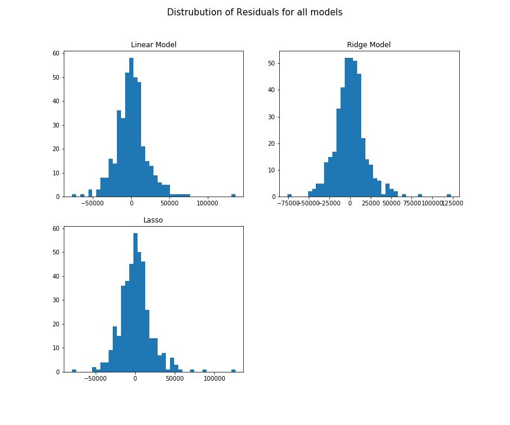
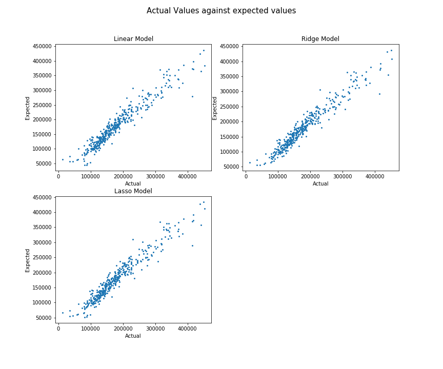
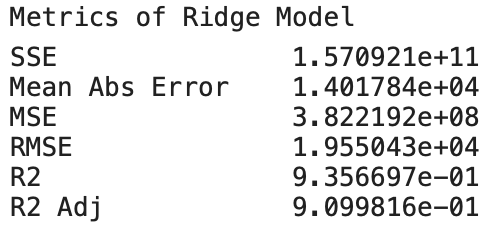

## Problem Statement:
---
I am working as a data science consultant for a large organization. They have been contracted by a realty company interested in gaining a data advantage in the world of home buying. Their current business model prioritizes the acquisition of newer properties in desirable locations, that possess the highest inspector ratings. This is both due to their value and the likelihood of these houses requiring less expense in maintenance and remodelling. Seeking to clarify the effectiveness of their business model, they have posed my organization some clarifying questions, as well as a request for a predictive algorithm that they can utilize going forward to forecast the likely selling prices of new homes coming on the market. 

- Key questions to answer, according to their business model:
  - What is the average selling price all homes?
  - Do newer houses (those less than 50 years old) sell significantly higher than the average price?
  - Do newer houses sell significanlty higher than older houses? *If they don't, this could be evidence that some other factor other than the age of a home is contributing to property pricing.*
  - If all these prove true - what is the average selling price of newer homes?
  - How does the overall ranking of a home affect the sale price?
  - How does the location of a home (in terms of its neighborhood) affect the price of a home?

I am specifically tasked with getting this information on behalf of our client, and reporting my findings to my project manager.

**My strategy for accomplishing this task:** Utilizing white box preditive models carries with it the benefit of interpretability of data. After conducting an analysis of primary factors, I will use two models - one simple model, focused on interpretable results to describe effects of key factors, and another that focuses primarily on optimal preditive power with minimal error.

From opendoor.com, [8 Critical Factors that Influence a Home's Value](https://www.opendoor.com/w/blog/factors-that-influence-home-value), it is indicated that location, size, and age, are three of the top factors, consistent with their business model. While I cannot look at nearby ammenities (such as schools or grocery stores) in this dataset, I can generally look at the neighborhoods themselves, to see how value interacts with their location.

## Conclusions:
---
- I can infer with 95% confidence from this data that the true average selling price of homes on the market is captured by the interval \\$178000 - \$185000.

*However, this may be misleading, as the distribution of sales prices are very right skewed, so I am also including here the median sale price.*

- I can infer with 95% confidence from this data that the true median selling price of homes on the market is captured by the interval \\$159,000 - \$166,000.

- I can state that this data is evidence that the mean saleprice of newer homes is not equal to the overall mean selling price.

- I again can state with 95% confidence that this data is evidence that the mean of newer and older houses is not the same.

- I can infer with 95% confidence from this data that the true average selling price of newer homes on the market is captured by the interval \\$215500 - \$225000.

## Results : Interpretable Model
---
*Note that the "ranks" shown above increase in quality as the number increases.*

The probability f-statistic is extremely low, indicating a high probability that **at least one** coefficient is predicting our target of saleprice to some degree.

Further, each variable is likely to actually predict the true housing saleprice (each P|t| < 0.05, so we can reject the null hypothesis that the true coefficient is zero for each independent variable - meaning that they corrrelate to some value relatively close to our coefficient value..

- For every additional square foot of property, we can expect on average to see an increase in saleprice that is captured by the interval \\$1.47 - \$2.10 in sale price, holding all other factors constant (between a 1.5:1 and a 2:1 ratio).

- For every additional year of age for a home, we can expect on average to see a decrease in saleprice that is captured by the interval \\$183.37 - \$484.69 loss in selling price, holding all other factors constant.

- A home being at the top overall rank ("Very Excellent") predicts a home selling for an increase captured by the interval  \\$312,000 - \$386,000 more, relative to that same home being ranked in the lowest overall rank ("Very Poor")

- A home being in the top tier ranked neighborhoods (Stone Brook, Northridge Heights, and Northridge) is expected to sell for an increase in price captured by the interval \\$34,000 - \$76,000 higher value, relative to that same home being in the lowest tier ranked neighborhoods (Briardale, Iowa DOT and Railroad, and Meadow Village)

## Results: Predictive Model
---
- The optimal model for predicting saleprices that I have built fits about 92% of the data it was trained on, and almost 90% of testing data that the model has not seen before. This indicates a very low bias, and likewise a low variance (it generalizes to new data well). It also minimizes error with a RMSE value of around 19,550. This model can be delivered to our client for the purposes of predicting sale prices of new homes as they arrive on the market.

